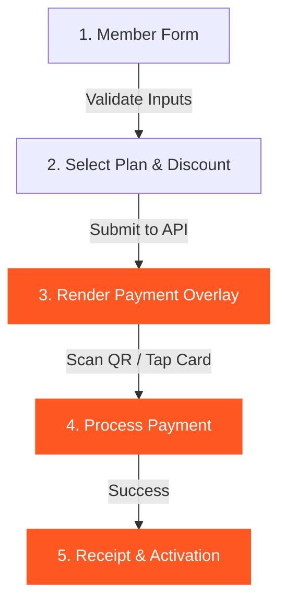

# Frontend Specification: Gym Management System

This document outlines the UI/UX design specifications, color theory, Gestalt guidelines, and client-server workflows for the Gym Management System frontend.

---

## 1. Visual Design & Color Theory

We are departing from standard dark templates to deliver an **athletic, high-contrast, tactile light aesthetic** that feels clean, modern, and high-energy.

### 1.1 Color Palette (Athletic Energy)
* **Canvas Background**: Crisp off-white (`#F8FAFC` / HSL `210, 40%, 98%`) to feel spacious and clean.
* **Surface Background**: Pure white (`#FFFFFF`) for panels, card overlays, and tables.
* **Accent (Action/Primary)**: Energetic Athletic Orange (`#FF5722` / HSL `14, 100%, 57%`). In color theory, orange triggers feelings of high energy, enthusiasm, movement, and physical action—perfect for a gym environment.
* **Primary Text & Headers**: Deep Charcoal Slate (`#0F172A` / HSL `222, 47%, 11%`) for readable contrast and premium structure.
* **Secondary Text & Borders**: Cool Muted Gray (`#64748B` for text, `#E2E8F0` for borders).

### 1.2 Tactile 3D Aesthetic (Soft UI / Neumorphic Depth)
To make cards and forms "pop" off the background with a realistic, premium 3D look:
* **Gradients**: Subtle vertical gradients on buttons and active states (e.g., from orange `#FF5722` to `#E64A19`).
* **Layered Shadows**: We simulate physical elevation using dual soft shadows rather than flat lines:
  ```css
  box-shadow: 
    0 1px 3px 0 rgba(0, 0, 0, 0.05),
    0 10px 15px -3px rgba(15, 23, 42, 0.04),
    0 4px 6px -2px rgba(15, 23, 42, 0.02);
  ```
* **Smooth Transitions**: Hover states use a `0.2s cubic-bezier(0.4, 0, 0.2, 1)` transition to slightly lift cards (translate Y upward by `2px` and deepen the shadow).

---

## 2. Key UX & UI Design Principles

### 2.1 Gestalt Principles
* **Law of Proximity**: Form inputs are grouped inside card panels with distinct spacing (e.g., all Member Details are kept in one card, Billing Details in another).
* **Law of Similarity**: High-priority action buttons (e.g., "Confirm Payment", "Register Member") use the solid primary **Athletic Orange** theme. Destructive/high-risk buttons (e.g., "Cancel Membership") use a clear red border.

### 2.2 Fitts's Law (Ease of Target Acquisition)
* **Button Sizing**: Primary action buttons are large, padded target zones (minimum height of `48px` to ensure easy clicking).
* **Contextual Placement**: The "Process Payment" confirm button is located directly underneath the QR code display zone, right in the center of the user's natural scanning flow.

### 2.3 State Shifts & Loading States
* **Skeleton Screens**: While fetching memberships or plans, the page displays gray skeleton loaders instead of a blank screen or a harsh spinning wheel, keeping the layout stable.
* **Disable Double-Submits**: Once the cashier clicks "Register" or "Confirm Payment", the button enters a disabled state with a loading spinner to prevent duplicate database transactions.

### 2.4 Error Recovery & Resilience (Staff Pain Points)
* **Real-Time Validation**: Instead of showing error alerts *after* hitting submit, inputs validate in real-time (e.g., highlighting the phone input with a soft red border and showing a small helper label if the format is invalid).
* **Payment Fail Recovery**: If a payment method is rejected or fails (e.g. card declined), the interface must **not** force the cashier to restart the registration from scratch. The cashier can switch the payment dropdown (e.g., from `CREDITCARD` to `BYCASH`) on the same overlay, preserving all member details.

---

## 3. The Cashier Subscription Workflow



### Steps in Detail

#### Step 1: Member Profile (Form)
* Fields: Full Name, Phone Number, Date of Birth, Gender (dropdown: `MALE`, `FEMALE`, `OTHER`).
* Validation: Inline phone number pattern check.

#### Step 2: Select Plan & Billing Parameters
* **Plan Dropdown**: Populated dynamically via `GET /api/plans`.
* **Discount Selector**: Text input for discount percentage (`0-100%`). The UI dynamically updates the calculated final cost.
* **Payment Method Dropdown**: Select `BYCASH`, `KHQR`, or `CREDITCARD`.

#### Step 3: Interactive Payment Overlay
* Generates a modal depending on the payment method:
  * **KHQR**: Shows a clean QR code box with a central logo, displaying the exact final amount.
  * **BYCASH**: Prompts the cashier to collect physical cash.
  * **CREDITCARD**: Prompts for card terminal processing.
* Action: A large **"Confirm Payment"** button that sends `POST /api/payments/{id}/process`.

---

## 4. API Endpoints Sheet

### 4.1 Login
* **Method**: `POST`
* **Path**: `/api/auth/login`
* **Payload**: `{"identifier": "admin", "password": "admin123"}`
* **Response (200)**: `{"id":"1", "name":"admin", "role":"ADMIN", "shift":"FULLTIME"}`

### 4.2 Get Membership Plans
* **Method**: `GET`
* **Path**: `/api/plans`
* **Response (200)**: Array of plan objects containing `planID`, `planName`, `planPrice`, `duration`.

### 4.3 Create Member
* **Method**: `POST`
* **Path**: `/api/members`
* **Payload**: `{"fullName": "Alice Smith", "gender": "FEMALE", "phoneNumber": "0987654321", "dob": "1998-04-12"}`

### 4.4 Create Subscription
* **Method**: `POST`
* **Path**: `/api/memberships`
* **Payload**:
  ```json
  {
    "memberID": "12",
    "planID": "2",
    "startDate": "2026-06-24",
    "discount": 10,
    "paymentMethod": "KHQR"
  }
  ```

### 4.5 Confirm Payment
* **Method**: `POST`
* **Path**: `/api/payments/{id}/process`
* **Payload**: `{"paymentMethod": "KHQR"}`
