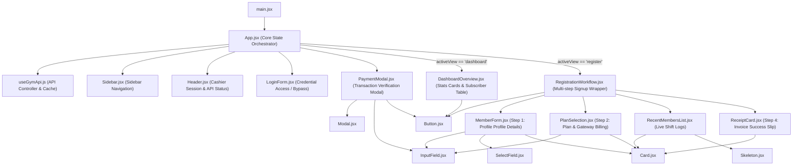
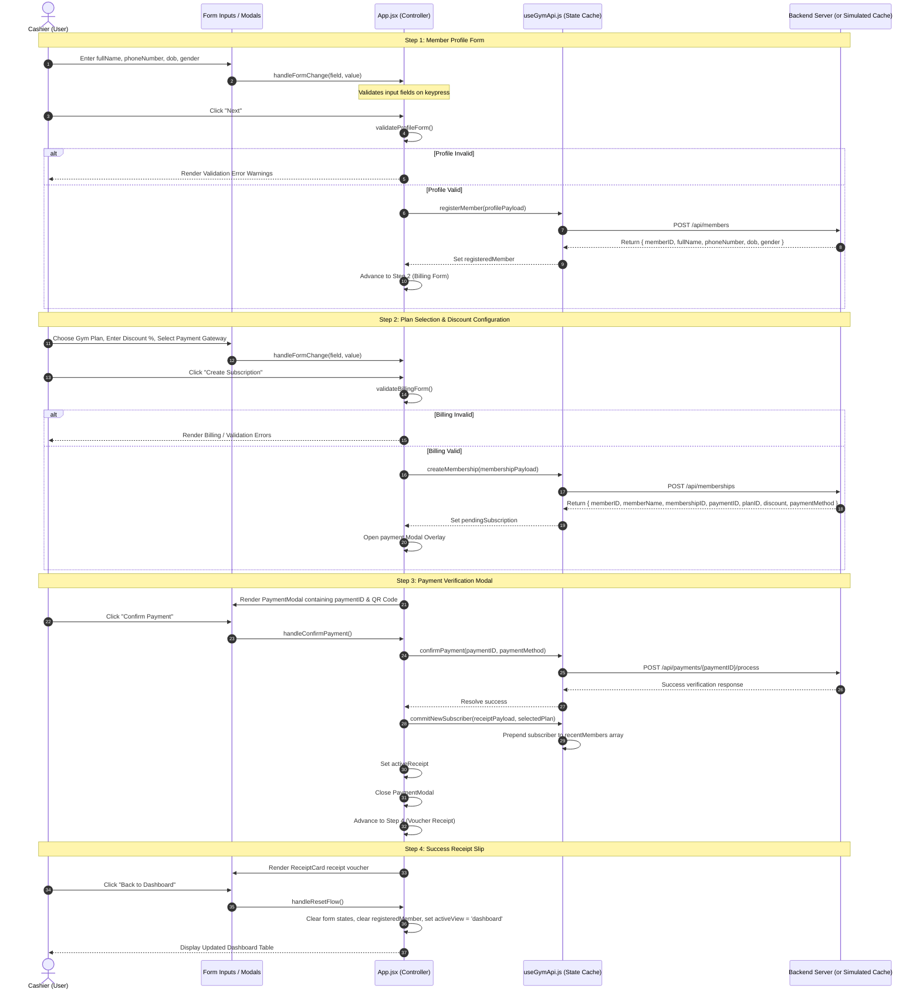

# Gym Management System - Architecture & Interactive Workflows Map

This document serves as a comprehensive, visual blueprint of the front-end codebase. It includes rendering dependency trees, state orchestration flows, multi-step transaction sequence diagrams, a full file index registry, and UI style class indicators.

Use this document to instantly identify which file holds a specific behavior, state, or styling property, eliminating the need to browse or scan files repeatedly.

---

## 1. Component Render & Dependency Tree

The diagram below maps how layout wrappers, active page views, features, and reusable UI components compose together:



---

## 2. State & Prop Orchestration Flow

This diagram maps how state hooks, shared parameters, and interactive handlers flow downwards through component properties:

```mermaid
graph TD
    App["App.jsx State Controller"]

    %% App State Outflows
    App -->|Prop: activeView| Sidebar["Sidebar.jsx (Sets navigation)"]
    App -->|Prop: activeView, cashier| Header["Header.jsx (Displays title & session details)"]
    App -->|Prop: form, errors, registeredMember| RegWorkflow["RegistrationWorkflow.jsx"]
    App -->|Prop: activeReceipt| RegWorkflow
    App -->|Prop: pendingSubscription| PayModal["PaymentModal.jsx"]

    %% Hook State Inflows
    useApi["useGymApi.js Hook"] -->|State: plans| App
    useApi -->|State: recentMembers| App
    useApi -->|State: cashier| App
    useApi -->|State: isSimulated| App
    useApi -->|State: isLoading, error| App
    useApi -->|Handlers: registerMember(), createMembership(), etc.| App

    %% Registration Workflows Sub-flows
    RegWorkflow -->|Prop: form, errors, handleFormChange| MemberForm["MemberForm.jsx (Step 1)"]
    RegWorkflow -->|Prop: form, plans, finalPrice| PlanSelection["PlanSelection.jsx (Step 2)"]
    RegWorkflow -->|Prop: recentMembers, isLoading| RecentMembersList["RecentMembersList.jsx"]
    RegWorkflow -->|Prop: activeReceipt| ReceiptCard["ReceiptCard.jsx (Step 4)"]
```

---

## 3. Registration Workflow & Payment Processing Sequence

The sequence diagram below displays the step-by-step transaction flow during registration, outlining validation checks, endpoint requests, and state commits:



---

## 4. Comprehensive File Registry Directory

The table below catalogs every file, details when to edit or ignore it, and highlights key props or state properties.

### Root Orchestration Files

| File Link | Core System Responsibility | Exports / APIs | When to Modify |
| :--- | :--- | :--- | :--- |
| [main.jsx](file:///d:/Camtech/Gym-Management-frontEnd/src/main.jsx) | Application mount point. | Mounts root `<App />`. | Only to update React mounting parameters or global wrappers. |
| [App.jsx](file:///d:/Camtech/Gym-Management-frontEnd/src/App.jsx) | Handles view routing, form validation, step states, and actions coordination. | Renders layout shells and conditionals. | To change step validation rules, adjust data flow, or edit layout routing. |
| [index.css](file:///d:/Camtech/Gym-Management-frontEnd/src/index.css) | Core style variables, brand color palettes, fonts, and base page reset styles. | Global CSS Custom Variables. | To update color themes, layout widths, typography, or base variables. |
| [App.css](file:///d:/Camtech/Gym-Management-frontEnd/src/App.css) | Layout grid properties, modal springs, table hovers, and page responsive media tags. | CSS Selectors. | To tweak button designs, layout gaps, animations, hovers, or shadows. |
| [useGymApi.js](file:///d:/Camtech/Gym-Management-frontEnd/src/hooks/useGymApi.js) | Central API hook. Fetches plans, manages cashiers, handle mock fallbacks. | `plans`, `recentMembers`, `registerMember()`, `createMembership()`, etc. | To adjust API URLs, update query logic, or configure mockup databases. |

### Component Subdirectories

#### Layout Panels: `src/components/layout/`

| File Link | Core System Responsibility | Prop Interfaces | When to Modify |
| :--- | :--- | :--- | :--- |
| [Header.jsx](file:///d:/Camtech/Gym-Management-frontEnd/src/components/layout/Header.jsx) | Top banner showing cashier name, role, connection status, and logout actions. | `activeView`, `isSimulated`, `cashier`, `logout` | To update top panel user actions, shift titles, or status symbols. |
| [Sidebar.jsx](file:///d:/Camtech/Gym-Management-frontEnd/src/components/layout/Sidebar.jsx) | Left sidebar list containing active/inactive navigation triggers. | `activeView`, `setActiveView` | To add new page sections, edit navigation buttons, or brand banners. |

#### Page Feature Views: `src/components/features/`

| File Link | Core System Responsibility | Component Imports / Prop Keys | When to Modify |
| :--- | :--- | :--- | :--- |
| [LoginForm.jsx](file:///d:/Camtech/Gym-Management-frontEnd/src/components/features/LoginForm.jsx) | Secure access shield for entering dashboard. | `onLogin`, `onBypass`, `isLoading`, `error` | To change login validations, update placeholder text, or style inputs. |
| [DashboardOverview.jsx](file:///d:/Camtech/Gym-Management-frontEnd/src/components/features/DashboardOverview.jsx) | Front dashboard grid rendering KPI statistics cards and members database list. | `recentMembers`, `setActiveView` | To display extra statistics metrics, re-column tables, or edit table headers. |
| [RegistrationWorkflow.jsx](file:///d:/Camtech/Gym-Management-frontEnd/src/components/features/RegistrationWorkflow.jsx) | Step flow controller that maps the registration pipeline steps. | `form`, `errors`, `plans`, `handleRegisterMember()`, `handleResetFlow()` | To modify step headers, add steps, or toggle sidebar view rules. |
| [MemberForm.jsx](file:///d:/Camtech/Gym-Management-frontEnd/src/components/features/MemberForm.jsx) | Step 1 form fields for capturing new client details. | `form`, `errors`, `handleFormChange`, `handleRegisterMember()`, `isFormLoading` | To add details fields (e.g. Email), add validations, or change layouts. |
| [PlanSelection.jsx](file:///d:/Camtech/Gym-Management-frontEnd/src/components/features/PlanSelection.jsx) | Step 2 pricing selection grid, discount forms, and checkout keys. | `form`, `errors`, `plans`, `finalPrice`, `handleFormChange`, `handleCreateMembership()` | To update discount thresholds, format currency, or display plan highlights. |
| [PaymentModal.jsx](file:///d:/Camtech/Gym-Management-frontEnd/src/components/features/PaymentModal.jsx) | Pop-up overlay containing QR verification, gateway choices, and confirmations. | `isOpen`, `paymentID`, `paymentMethod`, `totalAmount`, `onConfirm`, `onMethodChange` | To redesign checkouts, QR scans, payment states, or validation alerts. |
| [ReceiptCard.jsx](file:///d:/Camtech/Gym-Management-frontEnd/src/components/features/ReceiptCard.jsx) | Completed registration invoice receipt slip. | `activeReceipt`, `handleResetFlow` | To change receipt structures, print layouts, or transaction vouchers. |
| [RecentMembersList.jsx](file:///d:/Camtech/Gym-Management-frontEnd/src/components/features/RecentMembersList.jsx) | Live register logs sidebar panel tracker. | `recentMembers`, `isLoading` | To change live notifications list, skeleton sizes, or statuses. |

#### Reusable UI controls: `src/components/ui/`

| File Link | Design Responsibility | Core Prop API | When to Modify |
| :--- | :--- | :--- | :--- |
| [Button.jsx](file:///d:/Camtech/Gym-Management-frontEnd/src/components/ui/Button.jsx) | Standardized clickable layout button. | `variant`, `size`, `isLoading`, `onClick`, `children`, `disabled` | To update global button padding, loading indicators, or default outline colors. |
| [Card.jsx](file:///d:/Camtech/Gym-Management-frontEnd/src/components/ui/Card.jsx) | Soft-padded layout panels with optional elevations. | `title`, `subtitle`, `action`, `hoverable`, `children`, `className` | To adjust generic card sizes, borders, background colors, or shadow values. |
| [InputField.jsx](file:///d:/Camtech/Gym-Management-frontEnd/src/components/ui/InputField.jsx) | Unified field input with bottom validation hints. | `label`, `error`, `icon`, `type`, `value`, `onChange` | To add new input types, field validation icons, or clear-button overlays. |
| [Modal.jsx](file:///d:/Camtech/Gym-Management-frontEnd/src/components/ui/Modal.jsx) | Overlay dialog window with animation backdrops. | `isOpen`, `onClose`, `title`, `children` | To tweak modal backdrop blur, exit transitions, or modal wrapper sizes. |
| [SelectField.jsx](file:///d:/Camtech/Gym-Management-frontEnd/src/components/ui/SelectField.jsx) | Option selector dropdown containing icons. | `label`, `value`, `onChange`, `options`, `error`, `icon` | To adjust picklist widths, placeholder behavior, or dropdown carets. |
| [Skeleton.jsx](file:///d:/Camtech/Gym-Management-frontEnd/src/components/ui/Skeleton.jsx) | Pulsing loading placeholders. | `variant`, `width`, `height`, `className` | To change skeleton pulse speeds, glow colors, or corners. |

---

## 5. CSS Interactive Classes & Styling Variables

Use these pre-configured classes in `App.css` and variables in `index.css` to edit the app aesthetics, hover animations, and tactile affordances:

### Global Design Variable Tokens (`index.css`)
- `--bg-canvas`: Light background canvas.
- `--bg-card`: Card backdrop container coloring.
- `--bg-sidebar`: Dark navy blue sidebar background color.
- `--border-color`: Primary border outlining separator color.
- `--color-active-green` & `--color-active-green-bg`: Color styling for green active badges.

### Targetable Component Classes (`App.css`)
- `.recent-member-item`: Hover lift & active scale transitions inside the registration sidebar list.
- `.member-name-cell`: Name cell hover animations on the subscriber database table.
- `.member-status-tag`: Standardized Tailwind-style green status badges.
- `button.logout-btn`: Pastel red hover transition on the header logout action.
- `.stat-card`: Multi-dimensional bounce scale lift effects on statistics metrics.
- `.form-input:focus`: Blue highlight outline glow and scale-up focus borders.
